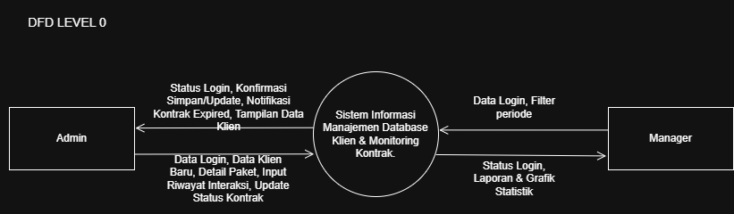
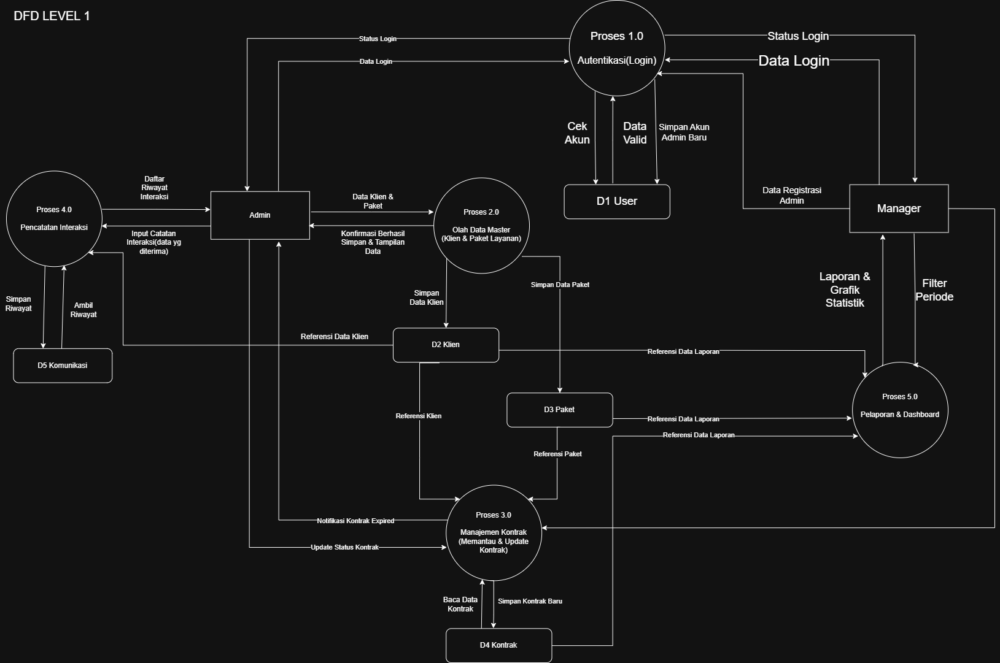

# 🚀 Tugas Besar: Sistem Database Klien

> **Dosen Pengampu:** Muhammad Shiddiq Azis, S.T., MBA

---

## 📊 Perancangan Sistem (DFD)

### DFD Level 0

_Diagram Konteks yang menunjukkan aliran data global._

### DFD Level 1

_Detail proses bisnis dan integrasi database._

---

## 🎨 Mockup Antarmuka

Rancangan UI aplikasi yang berfokus pada pengalaman pengguna.

| Login Page |   Dashboard    |   Core Feature    |
| :--------: | :------------: | :---------------: |
|  |  |  |

---

## 🛠️ Stack Teknologi

- **Frontend:**
- **Backend:**
- **Database:**

---

## 📂 Cara Instalasi
