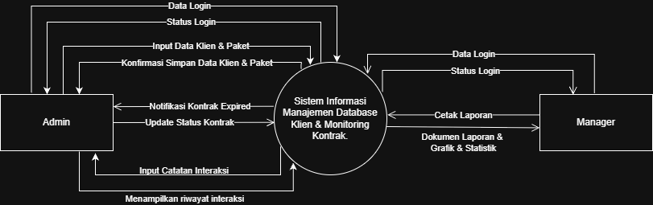
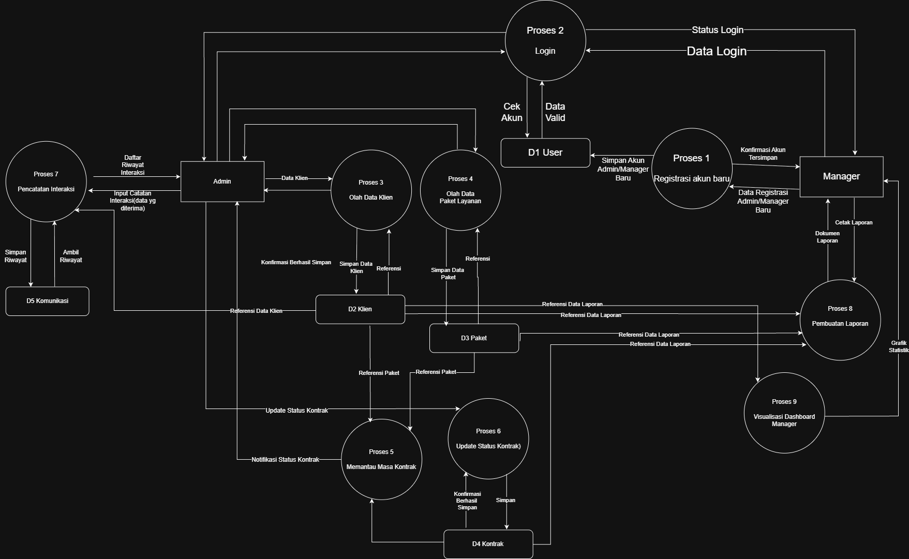
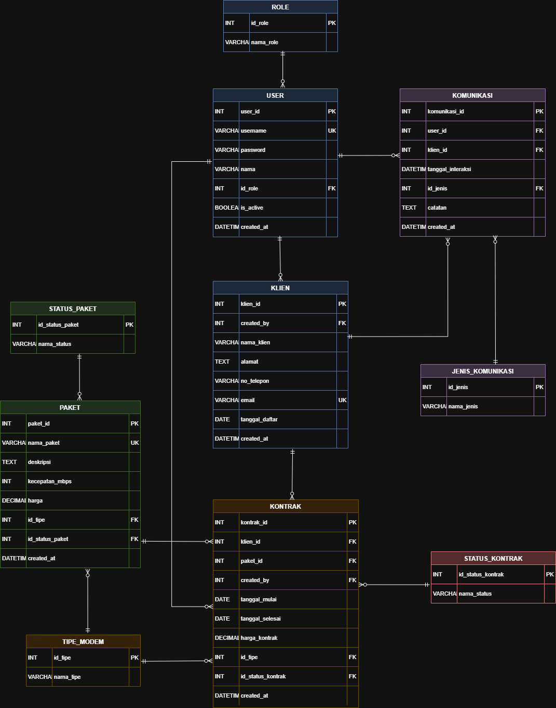
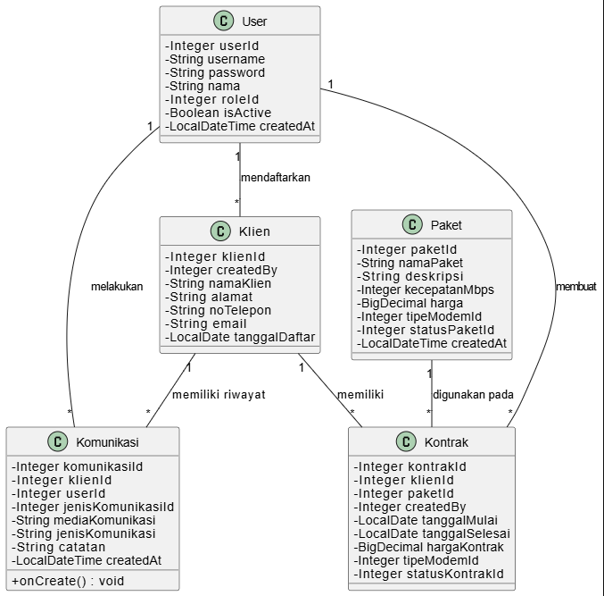
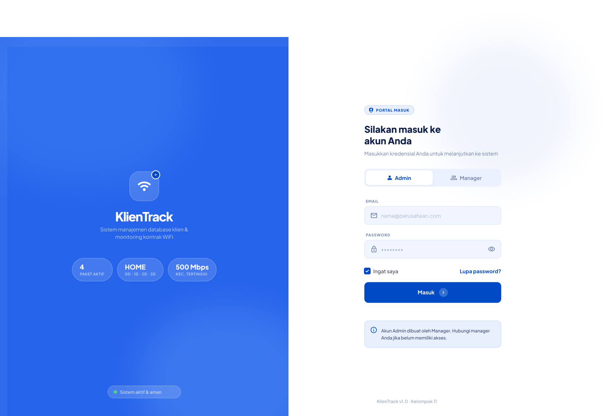
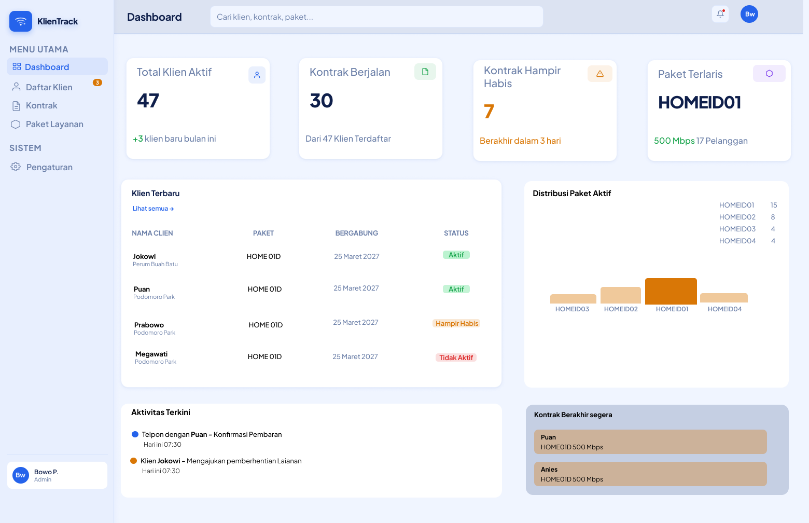
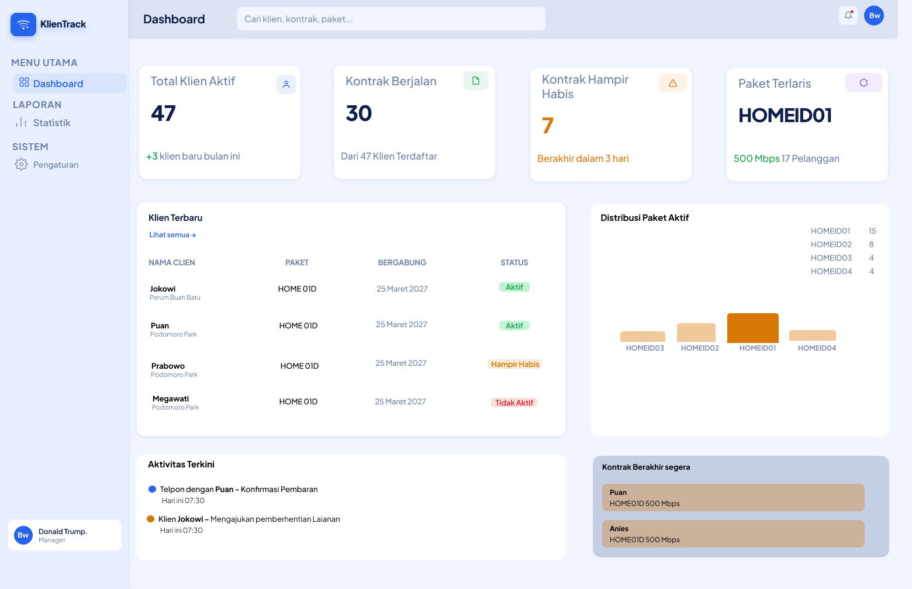
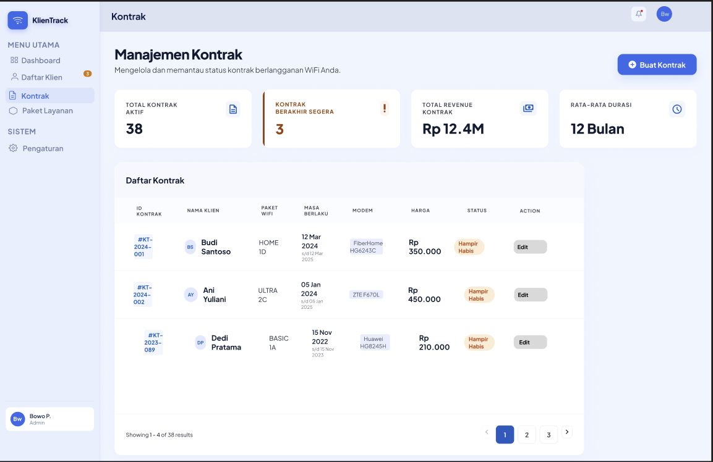
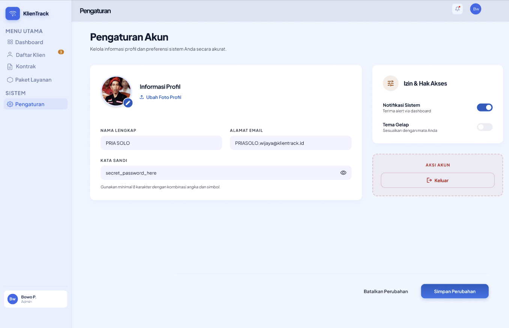
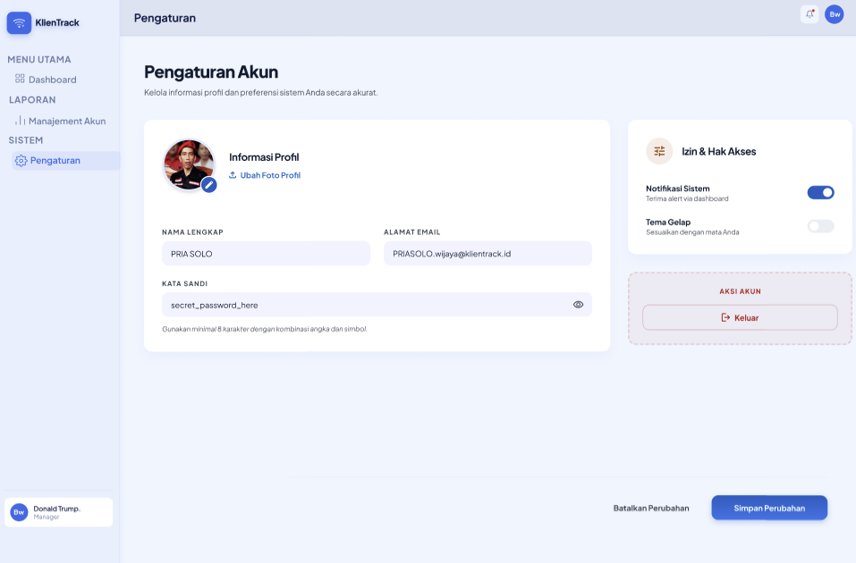

# 🚀 Tugas Besar: Sistem Database Klien

> **Dosen Pengampu:** Muhammad Shiddiq Azis, S.T., MBA

---

## 📊 Perancangan Sistem

Bagian ini memuat rancangan aliran data dan arsitektur sistem perangkat lunak.

### 1. Data Flow Diagram (DFD)

**DFD Level 0**   
_Diagram Konteks yang menunjukkan aliran data global._

**DFD Level 1**   
_Detail proses bisnis dan integrasi database._

### 2. Entity Relationship Diagram (ERD)

  
_Pemodelan struktur tabel basis data dan relasi antar entitas._

### 3. Class Diagram

  
_Struktur kelas, atribut, metode, dan hubungan antar objek dalam sistem._

---

## 🎨 Mockup Antarmuka

Rancangan UI aplikasi yang berfokus pada pengalaman pengguna.

### 🔐 Autentikasi & Dashboard Utama

| Login Page                                | Dashboard Admin                                          | Dashboard Manager                                            |
| :---------------------------------------: | :------------------------------------------------------: | :----------------------------------------------------------: |
|            |       |       |

### 👥 Manajemen Klien & Kontrak (Akses Admin)

| Daftar Client                                              | Detail Daftar Client                                                   | Edit Data Klien                                              | Buat Kontrak                                              |
| :--------------------------------------------------------: | :--------------------------------------------------------------------: | :----------------------------------------------------------: | :-------------------------------------------------------: |
|     | | |      |

| Konfirmasi Kontrak                                                          | Lihat Kontrak                              | Edit & Update Kontrak                                                    |
| :-------------------------------------------------------------------------: | :----------------------------------------: | :----------------------------------------------------------------------: |
|     |  |  |

### 📦 Manajemen Layanan & Paket (Akses Admin)

| Paket Layanan                                          | Tambah Paket Layanan                                              | Edit Detail Paket                                          |
| :----------------------------------------------------: | :---------------------------------------------------------------: | :--------------------------------------------------------: |
| |    |  |

### ⚙️ Pengaturan & Akun (Akses Admin & Manager)

| Pengaturan Admin                                    | Pengaturan Manager                                       | Tambah Akun Admin                                                   | Tambah Akun Manager                                                      | Edit Detail Akun                                                  |
| :-------------------------------------------------: | :------------------------------------------------------: | :-----------------------------------------------------------------: | :----------------------------------------------------------------------: | :---------------------------------------------------------------: |
|  |  |  |   | |

---

## 🛠️ Stack Teknologi

- **Frontend:** Bootstrap + Thymeleaf
- **Backend:** Spring Boot
- **Database:** MySQL

---

## 📂 Cara Instalasi

1. Clone repositori ini ke dalam direktori lokal Anda.
   ```bash
   git clone <url-repositori-anda>
