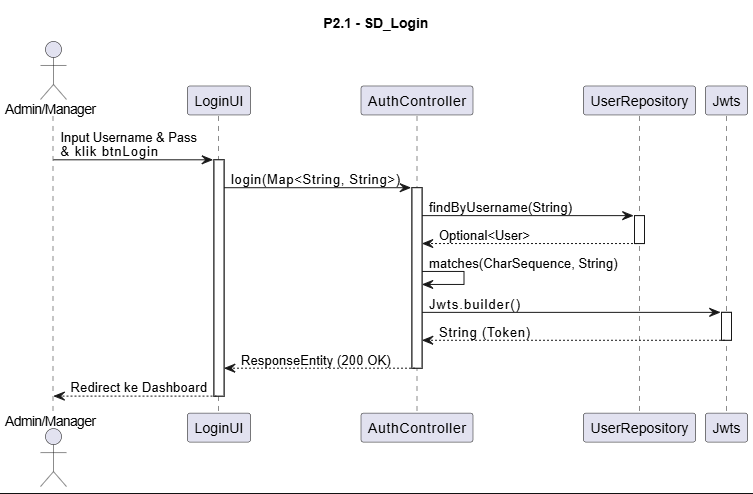
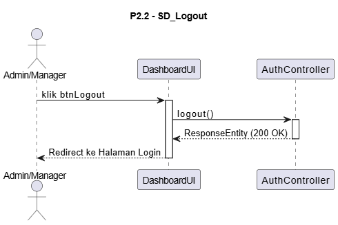

# 🚀 Tugas Besar: Sistem Database Klien

> **Dosen Pengampu:** Muhammad Shiddiq Azis, S.T., MBA

---

## 📊 Perancangan Sistem

Bagian ini memuat rancangan aliran data dan arsitektur sistem perangkat lunak.

---

### 1. Data Flow Diagram (DFD)

**DFD Level 0**

_Diagram Konteks yang menunjukkan aliran data global._

---

**DFD Level 1**

_Detail proses bisnis dan integrasi database._

---

### 2. Entity Relationship Diagram (ERD)

_Pemodelan struktur tabel basis data dan relasi antar entitas._

---

### 3. Sequence Diagram

Berikut daftar seluruh Sequence Diagram yang menggambarkan alur interaksi antar komponen sistem:

#### P1 — Registrasi Akun Baru (Autentikasi)

| Kode | Nama | File |
|------|------|------|
| P1.1 | Registrasi Akun Baru |  |

#### P2 — Login (Manajemen sesi)

| Kode | Nama | File |
|------|------|------|
| P2.1 | Login |  |
| P2.2 | Logout |  |
| P2.3 | Reset Password |  |

#### P3 — Olah data klien (Manajemen Klien)

| Kode | Nama | File |
|------|------|------|
| P3.1 | Tambah Data Klien |  |
| P3.2 | Detail Klien |  |
| P3.3 | Update Data Klien |  |
| P3.4 | Hapus Data Klien |  |

#### P4 — Olah data paket layanan (Manajemen Paket Layanan)

| Kode | Nama | File |
|------|------|------|
| P4.1 | Tambah Paket |  |
| P4.2 | List Paket Layanan |  |
| P4.3 | Edit Data Paket |  |
| P4.4 | Hapus Data Paket |  |

#### P5 — Memantau masa kontrak (Manajemen Kontrak)

| Kode | Nama | File |
|------|------|------|
| P5.1 | Buat Kontrak Baru |  |

#### P6 — Update Status Kontrak (Update Kontrak)

| Kode | Nama | File |
|------|------|------|
| P6.1 | Update Status Kontrak |  |

#### P7 — Pencatatan Interaksi (Riwayat Komunikasi)

| Kode | Nama | File |
|------|------|------|
| P7.1 | Tambah Riwayat Komunikasi |  |
| P7.2 | List Riwayat per Klien |  |

#### P8 —  Pembuatan Laporan (Laporan)

| Kode | Nama | File |
|------|------|------|
| P8.1 | Generate Laporan |  |

#### P9 — Visualisasi dashboard manager (Statistik & Dashboard)

| Kode | Nama | File |
|------|------|------|
| P9.1 | Statistik Pertumbuhan Pelanggan |  |

---

### 4. Class Diagram

_Struktur kelas, atribut, metode, dan hubungan antar objek dalam sistem._

---

## 🎨 Mockup Antarmuka

Rancangan UI aplikasi yang berfokus pada pengalaman pengguna.

### 🔐 Autentikasi & Dashboard Utama

|           Login Page            |                   Dashboard Admin                   |                    Dashboard Manager                    |
| :-----------------------------: | :-------------------------------------------------: | :-----------------------------------------------------: |
|  |  |  |

### 👥 Manajemen Klien & Kontrak (Akses Admin)

|                      Daftar Client                      |                          Detail Daftar Client                           |                        Edit Data Klien                        |                     Buat Kontrak                      |
| :-----------------------------------------------------: | :---------------------------------------------------------------------: | :-----------------------------------------------------------: | :---------------------------------------------------: |
|  |  |  |  |

|                            Konfirmasi Kontrak                            |                  Lihat Kontrak                  |                            Edit & Update Kontrak                            |
| :----------------------------------------------------------------------: | :---------------------------------------------: | :-------------------------------------------------------------------------: |
|  |  |  |

### 📦 Manajemen Layanan & Paket (Akses Admin)

|                      Paket Layanan                      |                      Tambah Paket Layanan                       |                     Edit Detail Paket                      |
| :-----------------------------------------------------: | :-------------------------------------------------------------: | :--------------------------------------------------------: |
|  |  |  |

### ⚙️ Pengaturan & Akun (Akses Admin & Manager)

|                   Pengaturan Admin                    |                    Pengaturan Manager                     |                          Tambah Akun Admin                          |                           Tambah Akun Manager                           |                          Edit Detail Akun                          |
| :---------------------------------------------------: | :-------------------------------------------------------: | :-----------------------------------------------------------------: | :---------------------------------------------------------------------: | :----------------------------------------------------------------: |
|  |  |  |  |  |

---

## 🛠️ Stack Teknologi

- **Frontend:** Bootstrap
- **Backend:** Spring Boot
- **Database:** MySQL

---

## 📂 Cara Instalasi
